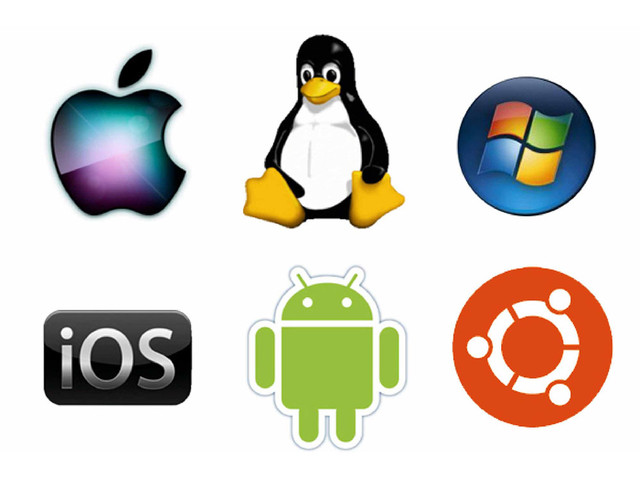
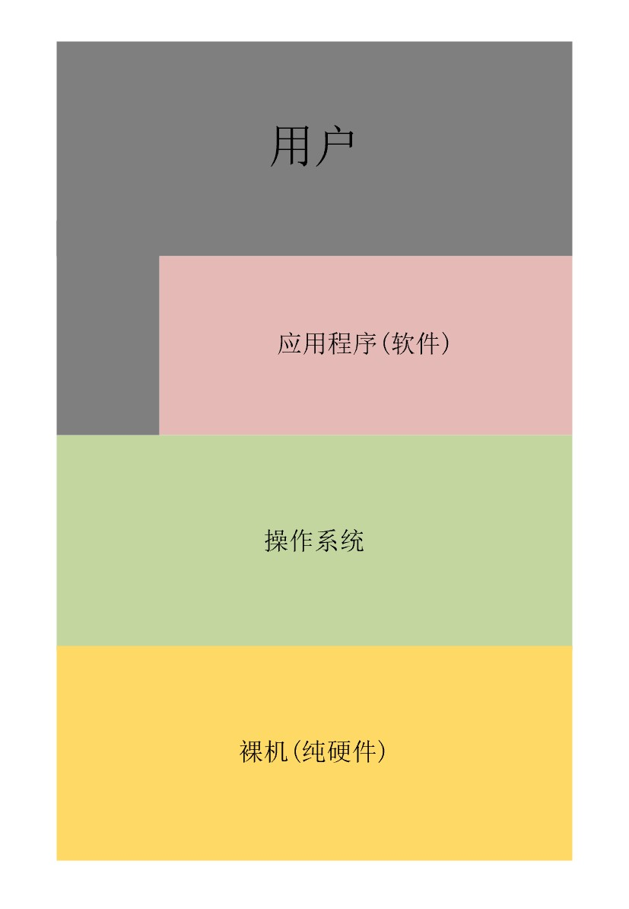
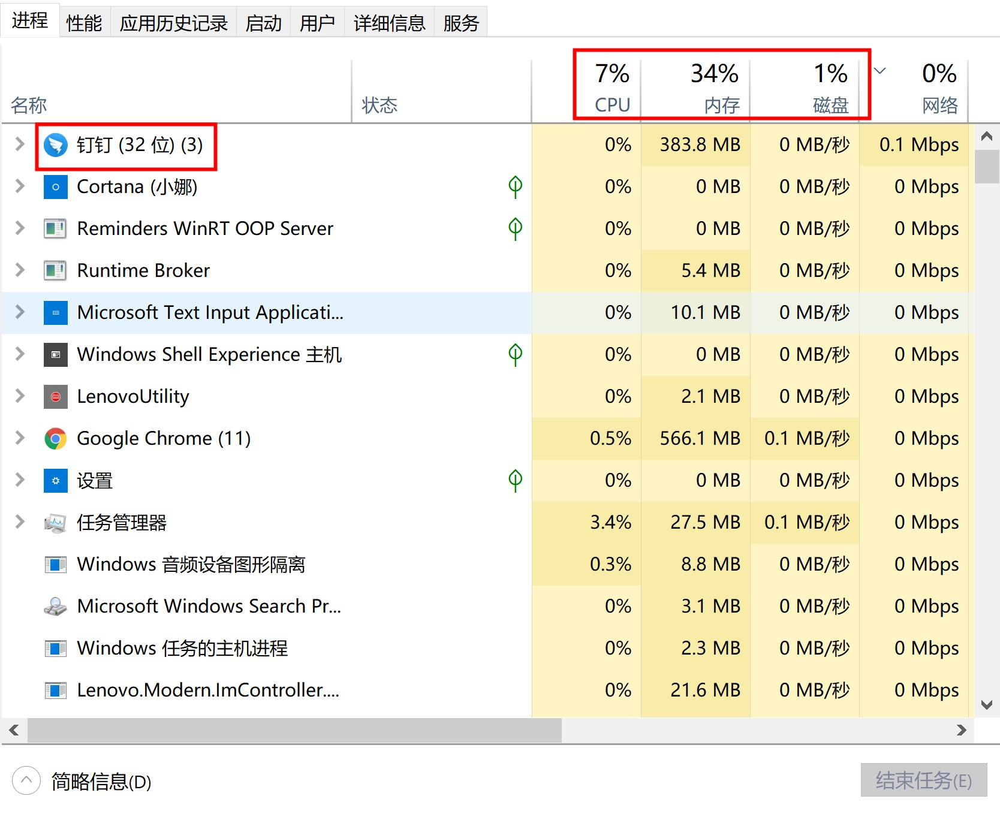
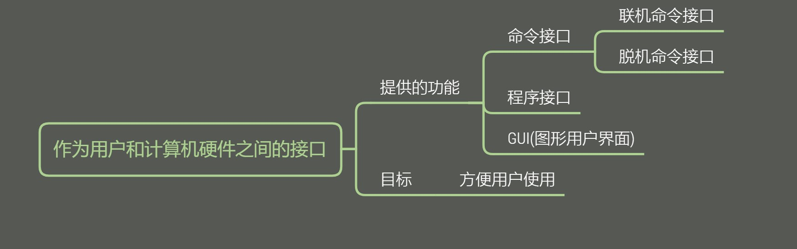
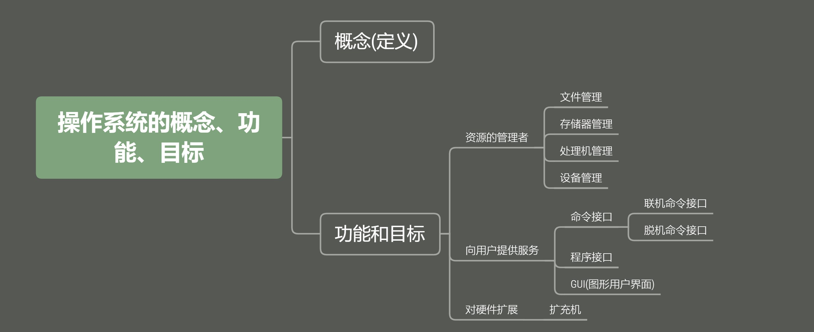

# 什么是操作系统？

### 操作系统的定义

操作系统(Operation System, OS) 是指控制和管理整个计算机系统的硬件和软件资源，并合理的组织和调度计算机的工作和资源的分配，以提供给用户和其它软件方便的接口和环境，它是计算机系统中最基本的系统软件。

操作系统层次结构如图。 

用户可以直接和操作系统进行交互，但是大多数情况下都是通过应用软件与操作系统进行交互。硬件指的是CPU、内存、硬盘等资源。

操作系统说明：

1. 负责管理协调硬件、软件等计算机资源的工作
2. 为上层的应用程序、用户提供简单易用的服务
3. 操作系统是系统软件，而不是硬件

操作系统对硬件和软件的管理例子：

### 操作系统的功能和目标

我们可以先想一下：

1. 操作系统作为 `系统资源的管理者` （资源包括硬件、软件、文件等），需要提供什么功能呢？
2. 操作系统作为 `用户与计算机硬件之间的接口` ，要为其上层的用户、应用程序提供简单易用的服务，需要提供什么功能？
3. 操作系统作为 `最接近硬件的层次`，需要在纯硬件的基础上实现什么功能？

#### 系统资源的管理者

我们以网易云音乐听歌为例：

step1: 找到安装目录 D:\install\163 music\CloudMusic\
step2: 双击cloudmusic.exe
step3: 网易云音乐运行中
step4: 放歌

在第一步中，我们所找的目录，是操作系统提供的文件管理功能。\
一个进程是一个程序执行过程，执行前需要将程序放到内存中，所以第二步是操作系统提供的存储器管理。\
一个进程要能正常的往下运行，需要分配CPU，所以第三步是操作系统提供的处理机(CPU)管理。\
网易云音乐能播放声音是因为调用了音频等设备，所以第四步是操作系统提供的设备管理。

#### 用户与计算机硬件之间的接口

作为用户和计算机硬件之间的接口，操作系统给我提供了：

命令接口：允许用户直接使用\
程序接口：允许用户通过程序间接使用\
GUI：现代操作系统中最流行的图形用户接口\
> 其中命令接口和程序接口统称为 `用户接口`
>

例子：

联机命令接口：用户说一句，系统做一句，比如在cmd中允许`time` 命令，就会和系统产生交互行为\
脱机命令接口：用户说一堆，系统做一堆，就是批处理命令\
程序接口：如一些 `.dll` 的文件，只能通过用户程序间接调用，该调用过程称之为 `系统调用`
GUI：比如删除文件可以直接拖拽到回收站，而不用输入命令

#### 最接近硬件的层次

没有任何软件支持的计算机成为 `裸机`。在裸机上安装操作系统，可以提供资源管理功能和方便用户的服务功能，将裸机改造成功能更强、使用更方便的机器。

所以操作系统作为最接近硬件的层次，需要实现对硬件机器的扩展。

通常把覆盖了软件的机器称之为 `扩充机器`，又称之 `虚拟机`。

### 总结

什么是操作系统介绍完了，下一章将介绍操作系统的特征。最后，我们以一张图介绍本文：

